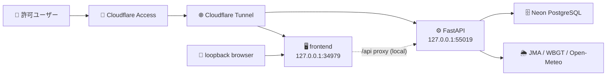

# Civil-Weather-Water-Decision

Construction Weather & Water Decision Support
気象・河川・施工判断支援システム

## 概要 / Purpose

気象庁・国土交通省 川の防災情報・環境省 WBGT・Open-Meteo などの公開データを統合し、
土木建設現場の作業判断（コンクリート打設・クレーン作業・河川内作業・土工・舗装・熱中症対策）を
支援する Web アプリケーションです。

## ⚠️ 重要なお知らせ / Important Notice

**本システムは施工判断を「支援」するものであり、作業の実施・中止・延期を自動決定するものではありません。**
最終判断は現場責任者が、発注者指示・契約条件・施工計画書・安全衛生計画・社内基準・現地目視確認・
気象庁/国土交通省/自治体等の公式発表を踏まえて行ってください。

システムは「いつ・どのデータを見て・なぜ注意と判断したか」の根拠と注意レベルを提示し、
データの欠測・遅延・不整合を隠さず明示します。

## 対象作業 / Initial Target Work Types

- コンクリート打設
- クレーン作業
- 河川内作業
- 土工
- 舗装
- 熱中症対策

## 主なデータソース / Main Data Sources

- 気象庁（防災情報XML・気象データ高度利用ポータル）
- 国土交通省 川の防災情報
- 水防災オープンデータ提供サービス
- Open-Meteo（予報・補完）
- 環境省 暑さ指数 WBGT
- NASA POWER / JAXA G-Portal・Earth API（将来拡張）

## 判断レベル / Decision Levels

| レベル | 表示 | 意味 |
|---|---|---|
| 0 | 通常 | 主要な注意条件なし（「作業可能」と断定しない） |
| 1 | 注意 | 一部条件に注意。現地確認・追加確認が必要 |
| 2 | 中止検討 | 中止・延期・作業方法変更を検討すべき条件あり |
| 3 | 確認不能 | 欠測・遅延・取得失敗で判断材料が不足 |

## ドキュメント / Documentation

- [要件定義書](./Civil-Weather-Water-Decision_Requirements.md)
- [詳細仕様設計書](./Civil-Weather-Water-Decision_Detailed_Design.md)
- [実装計画書（ロードマップ・WBS・リスク）](./docs/implementation-plan.md)
- [バックアップ・リストア手順](./docs/backup-restore.md)

## 🖥️ WebUI

WebUI は ClaudeDesign 生成 UI（`frontend/design/`）＋ `data-adapter.js` による実 API 接続で動作します。
詳細は [frontend/README.md](./frontend/README.md) を参照。

### 🌐 アクセス

| 経路 | URL | 備考 |
|---|---|---|
| 🔐 公開（Cloudflare Tunnel + Access） | `https://cwwd.mirai-dx-platform.com/` | 許可メンバーのみ（Access ログイン） |
| 🧪 ローカル検証 | `http://127.0.0.1:34979/` | 本番 frontend が `/api` を `CW_BACKEND_PROXY_BASE` 経由で backend へ loopback proxy |
| 🐳 Docker Compose | `http://localhost:3000/` | local専用。frontend が `/api` を `backend:8000` へ proxyし、backend `/health` 成功後に起動。DB/backend/frontend は `127.0.0.1` bind |

backend(55019)・frontend(34979)・cloudflared は **systemd 常駐**（OS 起動時に自動起動、`deploy/systemd/` 参照）。
本番 unit は backend/frontend を `127.0.0.1` に限定し、Cloudflare Tunnel + Access を唯一の公開入口にします。
loopback 直アクセス時は frontend が `/api`、`/health`、`/readyz` を固定 backend origin へ proxy するため、
production CORS を緩めずに同一オリジンで UI/API を確認できます。
監視は `/health`（プロセス応答）と `/readyz`（DB接続・Alembic head・主要テーブル）を使い分けます。
`cwwd-app-health-check.timer` が 5分周期で local backend/frontend、frontend `/api` proxy、public Cloudflare Access edge を検査します。
`cwwd-security-surface-check.timer` が15分周期で loopback origin の security headers、未認証API 401、
本番 docs/OpenAPI 404、frontend report-only CSP を検査します。
`cwwd-network-exposure-check.timer` が15分周期で 55019/34979 の LISTEN が loopback のみかを検査します。
`cwwd-systemd-unit-drift-check.timer` が30分周期で repo 正本と `/etc/systemd/system` の unit 一致を検査します。
revision等の詳細は認証付き `/api/admin/ops/readiness-detail`（admin/tech_manager）で確認します。
backend/frontend は `X-Content-Type-Options` / `X-Frame-Options` / `Referrer-Policy` /
`Permissions-Policy` / `Strict-Transport-Security` / COOP / CORP を付与し、API応答は `Cache-Control: no-store` で配信します。
frontend は runtime Babel / inline style 依存が残るため、CSP は `Content-Security-Policy-Report-Only`
で監視運用します。local E2E / 開発用の `?api=http://127.0.0.1:<port>` を保つため、report-only の
`connect-src` は loopback を許可し、precompile 後に enforce へ移行します。
backend API は `default-src 'none'` の厳格 CSP を付与し、FastAPI の `/docs` / `/redoc` / `/openapi.json`
は `APP_ENV=local` のみ有効にしています。



### 🗺️ メニュー体系（#72/#79）

```
📊 ダッシュボード
🏗️ 現場管理        現場一覧 / ＋現場登録
🌤️ 気象・海象データ  気象データ：全国版 / 海象データ：全国版※
⚖️ 施工判定        作業判断 / コンクリート打設 / 海上作業※ / 熱中症・WBGT
📈 分析           判断履歴 / 過去データ分析 / 50年確率波※
⚙️ 管理           閾値管理 / データ取得状況 / 運用状態 / レポート出力 / 監査ログ / 設定（通知・保存期間・AI設定）
```
※印は準備中（データソース調査・蓄積が前提。エピック #72 段5-7）。
管理系はロール制御（閾値管理・運用状態・監査ログ=admin/技術管理者、設定=admin）。

## 開発ステータス / Status

| 項目 | 内容 |
|---|---|
| フェーズ | Phase 2 進行中（Phase 1 MVP完了・Phase 3 認証/監査/通知は大幅先行・Phase 4 CI/CD着手済み） |
| 登録日 | 2026-06-19 |
| 本番リリース期限 | 2026-12-19（登録から6ヶ月） |
| 本番反映 | 2026-07-13: `APP_ENV=production`、loopback bind、Cloudflare Access、Neon PostgreSQL、デモユーザー無効化を実機適用 |
| テスト状況 | backend 409 / frontend logic 21 + adapter契約 29 + API設定ポリシー3 + serve proxy policy + CDN policy + vendor asset policy + E2E smoke、deploy script syntax、systemd verify 全pass（2026-07-13時点） |
| CI | GitHub Actions（backend lint+test / 依存脆弱性スキャン / frontend test / E2E smoke / docker build） |

マイルストーン・タスクは GitHub Issues / Milestones で管理します。

## 技術スタック / Tech Stack

- フロントエンド: ClaudeDesign 生成の静的 UI（dc-runtime、React/ReactDOM/Babel/Leaflet は `frontend/design/vendor/` からself-host、地図タイルは既定なし/内部URL明示）＋ `data-adapter.js` による実 API 接続
- バックエンド: FastAPI (Python 3.12) + SQLAlchemy + Alembic + APScheduler
- 認証/認可: JWT + RBAC（管理者・技術管理者・現場管理者・安全担当・閲覧）＋ 永続トークン失効台帳 ＋ DB永続ログインロックアウト ＋ 監査ログ（ドメイン変更と同一トランザクション記録）
- 本番ガード: `APP_ENV!=local` では強力な `JWT_SECRET` / `SETTINGS_ENCRYPTION_KEY`、短期ローテーション用 `SETTINGS_ENCRYPTION_PREVIOUS_KEYS` の強度、`ADMIN_PASSWORD`、PostgreSQL、HTTPS限定CORS、認証有効化を起動時に強制
- DB: **Neon PostgreSQL**（本番・2026-07-12 切替済み）/ SQLite（テスト）※同一 Alembic マイグレーションが両対応
- 公開基盤: systemd 常駐（backend/frontend/cloudflared）＋ Cloudflare Tunnel ＋ Cloudflare Access（エッジ認可）
- 本番監視: `cwwd-app-health-check.timer` が `/health`、`/readyz`、frontend 200、frontend `/api/auth/me` proxy 401、public URL 302（Cloudflare Access）を5分周期で検査
  `cwwd-cloudflared-config-check.timer` が30分周期で Tunnel ingress の backend/docs/frontend/catch-all ルール drift を検出。
  `cwwd-public-edge-access-check.timer` が15分周期で public `/` / `/api/sites` / `/health` / `/readyz` / docs/OpenAPI が
  未認証で Cloudflare Access 302 + Access login Location になることを検査。
  `cwwd-security-surface-check.timer` が15分周期で loopback origin の security headers、未認証API 401、
  production docs/OpenAPI 404、frontend report-only CSP を検査。
  `cwwd-network-exposure-check.timer` が15分周期で backend/frontend ports の非loopback LISTEN を検出。
  `cwwd-systemd-unit-drift-check.timer` が30分周期で systemd unit の適用 drift を検出。
  `cwwd-systemd-timer-freshness-check.timer` が30分周期で主要 timer の停止・無効化・発火遅延を検出。
  `cwwd-secret-file-permission-check.timer` が30分周期で本番秘密/設定ファイルの owner/mode drift を検出。
  `cwwd-ops-status.timer` が30分周期で主要 service/timer と failed unit の snapshot を journald に記録し、
  `deploy/scripts/ops-status.sh --json` で同じ情報を secret-free JSON として出力。
  `cwwd-ops-status-json-export.timer` が30分周期で `/var/lib/cwwd/ops-status.json` へ mode 0640 の
  machine-readable snapshot を atomically 保存。
  `cwwd-ops-status-json-check.timer` が30分周期で snapshot の freshness/JSON/status/権限を検査。
  認証付き `/api/admin/ops/status-snapshot`（admin/tech_manager）が snapshot を allowlist 済み JSON で返し、
  管理メニューの「運用状態」画面が `opsStatusSnapshot()` から認証付きで取得して表示する。
  `ops-failed-units-report.sh` で failed cwwd unit の秘匿済み診断スナップショットを取得可能。
  `cwwd-disk-space-check.timer` が1時間周期で `/` と backup/export dirs の空き容量・inode を監視。
- ローカルCompose: Postgres/backend/frontend は localhost 限定公開。`.env` の `POSTGRES_PASSWORD` 未設定では起動不可。
  frontend は backend `/health` の service_healthy を待ってから起動し、`/api` を compose service `backend:8000` へ proxy。
- バックアップ: Neon PITR + `pg_dump` custom format の論理ダンプ手順（`docs/backup-restore.md`）。
  `cwwd-db-backup.timer` が `/var/backups/cwwd/postgres` へ日次 dump を作成し、14日保持で pruning。
  `cwwd-db-backup-export.timer` が dump + `.sha256` を `/var/backups/cwwd/exports` へ AES256 暗号化 export。
  `cwwd-db-backup-check.timer` が hourly で最新 dump の age/checksum/orphan/権限を監視。
  `cwwd-db-backup-export-check.timer` が hourly で暗号化 export の age/checksum/orphan/権限/復号tar一覧を監視。
  `cwwd-db-backup-restore-drill.timer` が daily で最新 dump を `pg_restore --list` できるか DB 接続なしで検証。
  `ops-alert.sh` が backup/check failure を journald に記録し、任意の DB 非依存 Slack/Teams webhook へ送信。
  backup job は DB-only env file を使い、接続パスワードを `pg_dump` / `pg_restore` argv に出さない。
  `db-restore.sh` は `.dump.sha256` 検証を既定必須にし、未検証リストアは明示 opt-out のみ許可
- CI/CD: GitHub Actions（lint・test・E2E smoke・依存脆弱性スキャン・docker build）＋ Codex 対抗レビュー/CodeRabbit

> フロントエンドは PoC 当初計画（React+Vite+TypeScript+Tailwind の自前実装）から、ClaudeDesign 生成 UI ＋ 外部データアダプタ方式へ変更されています。詳細は [frontend/README.md](./frontend/README.md) を参照してください。

## ライセンス / License

[LICENSE](./LICENSE) を参照してください。
