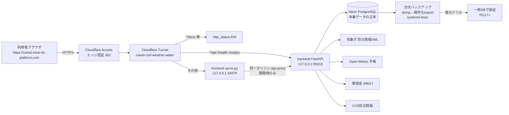
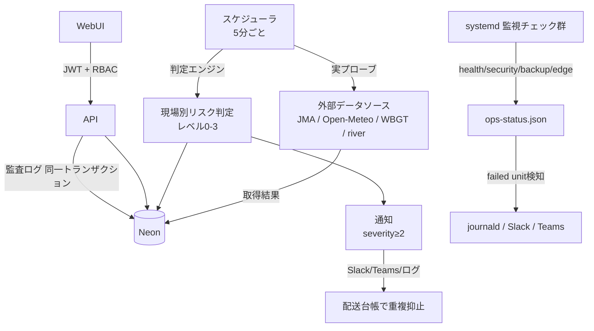

# Civil-Weather-Water-Decision

Construction Weather & Water Decision Support
気象・河川・施工判断支援システム

## 概要 / Purpose

気象庁・国土交通省 川の防災情報・環境省 WBGT・Open-Meteo などの公開データを統合し、
土木建設現場の作業判断（コンクリート打設・クレーン作業・河川内作業・土工・舗装・熱中症対策）を
支援する Web アプリケーションです。

## ⚠️ 重要なお知らせ / Important Notice

**本システムは施工判断を「支援」するものであり、作業の実施・中止・延期を自動決定するものではありません。**
最終判断は現場責任者が、発注者指示・契約条件・施工計画書・安全衛生計画・社内基準・現地目視確認・
気象庁/国土交通省/自治体等の公式発表を踏まえて行ってください。

システムは「いつ・どのデータを見て・なぜ注意と判断したか」の根拠と注意レベルを提示し、
データの欠測・遅延・不整合を隠さず明示します。

## 対象作業 / Initial Target Work Types

- コンクリート打設
- クレーン作業
- 河川内作業
- 土工
- 舗装
- 熱中症対策

## 主なデータソース / Main Data Sources

- 気象庁（防災情報XML・気象データ高度利用ポータル）
- 国土交通省 川の防災情報（現時点は公式リンク・手動実測のみ。自動取得は未接続）
- 水防災オープンデータ提供サービス
- Open-Meteo（予報・補完）
- 環境省 暑さ指数 WBGT
- NASA POWER / JAXA G-Portal・Earth API（将来拡張）

## 判断レベル / Decision Levels

| レベル | 表示 | 意味 |
|---|---|---|
| 0 | 通常 | 主要な注意条件なし（「作業可能」と断定しない） |
| 1 | 注意 | 一部条件に注意。現地確認・追加確認が必要 |
| 2 | 中止検討 | 中止・延期・作業方法変更を検討すべき条件あり |
| 3 | 確認不能 | 欠測・遅延・取得失敗で判断材料が不足 |

## ドキュメント / Documentation

- [要件定義書](./Civil-Weather-Water-Decision_Requirements.md)
- [詳細仕様設計書](./Civil-Weather-Water-Decision_Detailed_Design.md)
- [実装計画書（ロードマップ・WBS・リスク）](./docs/implementation-plan.md)
- [デプロイ手順 / 運用チェック](./docs/deploy.md)
- [バックアップ・リストア手順](./docs/backup-restore.md)
- [河川観測アーキテクチャ設計](./docs/design/river-observation-architecture.md)
- [Entra ID OIDC 基本設計](./docs/design/entra-id-oidc.md)
- [現場単位権限 基本設計](./docs/design/site-level-permissions.md)
- [閾値 安全・技術レビュー用資料](./docs/threshold-safety-review.md)
- [PoC 受入基準（3現場・30日間）](./docs/acceptance/poc-acceptance.md)
- [リリースノート](./docs/release-notes.md)

## システム構成 / Architecture



### データフロー / Data Flow



> 図は 2026-08-01 時点の本番構成（tunnel ingress・systemd unit・監視スクリプト）に基づきます。
> 変更時は `deploy/systemd/`・`~/.cloudflared/config-cwwd.yml`・`docs/deploy.md` と整合させてください。

## 🖥️ WebUI

WebUI は ClaudeDesign 生成 UI（`frontend/design/`）＋ `data-adapter.js` による実 API 接続で動作します。
詳細は [frontend/README.md](./frontend/README.md) を参照。

### 🌐 アクセス

| 経路 | URL | 備考 |
|---|---|---|
| 公開（Cloudflare Tunnel + Access） | `https://cwwd.mirai-dx-platform.com/` | 許可メンバーのみ（Access ログイン） |

backend(55019)・frontend(34979)・cloudflared は **systemd 常駐**（OS 起動時に自動起動、`deploy/systemd/` 参照）。
本番では backend/frontend とも **loopback (127.0.0.1) のみ**で listen し、公開は Cloudflare Tunnel 経路に限定しています。
LAN 直アクセスは不要な公開面になるため既定で無効です（開発時のみ `HOST=0.0.0.0` を明示して使用）。

### セキュリティ / 運用チェック

- backend API・frontend 配信ともセキュリティヘッダ（`X-Content-Type-Options` / `X-Frame-Options` /
  `Referrer-Policy` / `Permissions-Policy` / HSTS / COOP / CORP 等）を付与し、API 応答は `Cache-Control: no-store`。
- 本番では Swagger UI（`/docs` `/redoc` `/openapi.json`）を無効化。
- 監視は systemd 定期チェック（app health / security surface / network exposure / public edge /
  DB backup freshness / restore drill / ops status snapshot）で自動検証され、失敗は journald / Slack / Teams へ通知。
  スクリプトの正本は `deploy/scripts/`、unit の正本は `deploy/systemd/`。

### 🗺️ メニュー体系（#72/#79）

```
📊 ダッシュボード
🏗️ 現場管理        現場一覧 / ＋現場登録
🌤️ 気象・海象データ  気象データ：全国版 / 海象データ：全国版※
⚖️ 施工判定        作業判断 / コンクリート打設 / 海上作業※ / 熱中症・WBGT
📈 分析           判断履歴 / 過去データ分析 / 50年確率波※
⚙️ 管理           閾値管理 / データ取得状況 / レポート出力 / 監査ログ / 設定（通知・保存期間・AI設定）
```
※印は準備中（データソース調査・蓄積が前提。エピック #72 段5-7）。
管理系はロール制御（閾値管理・監査ログ=admin/技術管理者、設定=admin）。

## 開発ステータス / Status

| 項目 | 内容 |
|---|---|
| フェーズ | Phase 2 進行中（Phase 1 MVP完了・Phase 3 認証/監査/通知は大幅先行・Phase 4 CI/CD着手済み） |
| 登録日 | 2026-06-19 |
| 本番リリース期限 | 2026-12-19（登録から6ヶ月） |
| テスト状況 | backend 405 / frontend 74（logic 21 + adapter契約 47 + policy系 6）、全pass（2026-08-05時点） |
| CI | GitHub Actions（backend lint+test / 依存脆弱性スキャン / frontend test / docker build） |

### 河川観測のステータス

2026-08-05 時点:

- ✅ 観測所マスタ・現場紐付け（上流/最寄り/参照）・手動実測値の保存と時系列API
- ✅ UIに「自動取得は未接続（未実装）」を明示（誤って実測済みと見せない）
- ❌ 自動取得（水防災オープンデータ提供サービス等）は未接続。判定エンジンへの実測値組み込みも未着手

マイルストーン・タスクは GitHub Issues / Milestones で管理します。

## 技術スタック / Tech Stack

- フロントエンド: ClaudeDesign 生成の静的 UI（dc-runtime、React 18 を CDN 経由でロード）＋ `data-adapter.js` による実 API 接続（`.dc.html` 無改修）
- バックエンド: FastAPI (Python 3.12) + SQLAlchemy + Alembic + APScheduler
- 認証/認可: JWT + RBAC（管理者・技術管理者・現場管理者・安全担当・閲覧）＋ 監査ログ（ドメイン変更と同一トランザクション記録）
- DB: **Neon PostgreSQL**（本番・2026-07-12 切替済み）/ SQLite（テスト）※同一 Alembic マイグレーションが両対応
- 公開基盤: systemd 常駐（backend/frontend/cloudflared）＋ Cloudflare Tunnel ＋ Cloudflare Access（エッジ認可）＋
  セキュリティヘッダ・loopback bind・本番docs無効化
- CI/CD: GitHub Actions（lint・test・依存脆弱性スキャン・docker build）＋ Codex 対抗レビュー/CodeRabbit

> フロントエンドは PoC 当初計画（React+Vite+TypeScript+Tailwind の自前実装）から、ClaudeDesign 生成 UI ＋ 外部データアダプタ方式へ変更されています。詳細は [frontend/README.md](./frontend/README.md) を参照してください。

## ライセンス / License

[LICENSE](./LICENSE) を参照してください。
